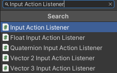
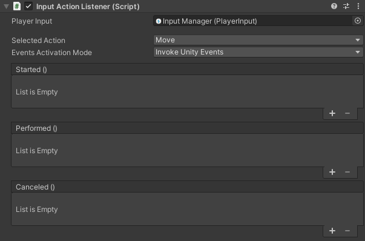

# Unity Input Action Listeners

This package aims to provide helper components for using the new [Unity Input System](https://docs.unity3d.com/Packages/com.unity.inputsystem@1.0/manual/index.html). It handles all the logic behind the different Input Actions registered inside an *Input Action Asset*.

This is a rework of a previous asset I made called [UPIW](https://github.com/sticmac/upiw) which was very uncomplete and unpractical. So I decided to rework it entirely.

## How does it work?

This package is working with custom Unity components designed to capture and handle some specific user inputs. All of the different components are made to handle different possible parameters, from none to float, vectors or quaternions for example. To use a listener, you just need to add it as a component to one of your game objects.



The listeners are separated in two categories: the **parametrized** and **non parametrized** listeners. The only non-parametrized listener is `InputActionListener` which listens for actions without sending any parameter in particular. The parametrized listeners are all the other available ones (for now `FloatInputActionListener`, `QuaternionInputActionListener`, `Vector2InputActionListener`, `Vector3InputActionListener`). Each of them handles input actions with a value whose type corresponds to the listener's name.

So for example, if you want to listen to an axis input, which returns a float value, you would probably want to go for a `FloatInputActionListener`. On the other hand, if you just want to know when a button is pressed, you'd rather use the parameterless `InputActionListener`.

### Listener component



All listeners have similar editor UI.

First, they ask you for a *Player Input* component they can be based on. This is a mandatory parameter to fill so the component can parse actions.

You then have a list of the available actions to select under a dropdown menu. Just select the one you want to listen to and you're good to go.

*Events* are the tools used by the listener to call for specific callback functions for any given action state. There are 3 different events: Started, Performed and Canceled. Each are triggered at the correct Input Action Phase, as described in the [corresponding Unity Input System documentation article](https://docs.unity3d.com/Packages/com.unity.inputsystem@1.0/manual/Actions.html#responding-to-actions).

You can use them in two different modes:

* *Unity Events*, which allow you to plug specific functions to each event directly from the editor.
* *C# Events*, which allow you to plug functions to each event through scripts and code.

There is no good or bad solution, and you may need to use a bit of both in different situations, which is what the `Events Activation Mode` parameter is for.

If you choose `Invoke Unity Events`, the corresponding Unity Events for the started, performed and canceled states are showing in the editor. You can then add functions to call from there.

If you change it for `Invoke C Sharp Events`, the Unity Events will disappear from the editor and the inner `Started`, `Performed` and `Canceled` action events will be triggered instead.

### Using a Listener in code

You can add a Listener parameter inside a script by the usual command.

```csharp
[SerializeField] InputActionListener _listener
```

In order for this to work, you'll need to use the namespace of the package at the beginning of your script.

```csharp
using Sticmac.InputActionListeners;
```

If your listener is invoking C# Events, you can simply add your callback function through code. For example:

```csharp
// Add a callback
_listener.Started += MyCallbackFunction;

// Remove a callback
_listener.Started -= MyCallbackFunction;
```

This is presuming `MyCallbackFunction` is a void function which takes at most one parameter according to the listener (no parameter for `InputActionListener`, `float` parameter for `FloatInputActionListener`, etc…).

## Installation

### Git

If you have access to this package through a git repository, you can add the package to the package manager (+ -> Add package from Git URL…). You can also add it directly to your project's `manifest.json` dependencies:

```json
    "fr.sticmac.inputactionlisteners": "<git url>"
```

### Local download

If you got this package through direct downloading, you can directly add it through the package manager as local package (+ -> Add package from disk…). 

Adding the package folder directly inside the Assets folder is also possible. You may need to import the different Assembly Definitions inside your project. You may find more information in the [corresponding article in the Assembly Definitions](https://docs.unity3d.com/2019.4/Documentation/Manual/ScriptCompilationAssemblyDefinitionFiles.html).
